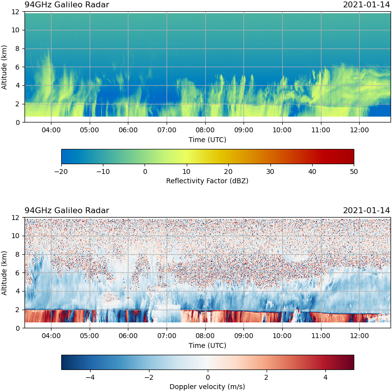

========
Overview
========

WIVERN-2 Chilbolton Campaign Dataset
------------------------------------

This documentation describes the dataset collected using ground-based radars
at Chilbolton Obervatory in the UK for the Doppler Wind Radar Science
Performance Study (WIVERN-2), funded by the European Space Agency (ESA) under
Contract no. 4000130864/20/NL/CT.

Data in NetCDF-4 format (see :ref:`file-format`) are provided from the following
three radars:

* 3GHz CAMRa radar (ncas-radar-camra-1)
* 35GHz Copernicus radar (ncas-radar-ka-band-1)
* 94GHz Galileo radar (ncas-radar-w-band-1)

The data are arranged into a series of one or more rain events per day of
observation, with any extended non-rainy periods being omitted.

A set of height-time quicklooks is also provided to enable the user to identify
periods of particular interest. An example is given here:

Documentation is provided for the Python
routines that were used in

The second set of routines produce quicklooks from the time-series data.
Specifically, they produce plots of radar equivalent reflectivity and of
pulse-pair estimates of the Doppler velocity.  No velocity unfolding is performed.

..
  .. note::

    Near real-time Cloudnet data can be accessed at https://cloudnet.fmi.fi.

..
  See also:
